# 🎙️ VoiceFlow AI
<div align="center">

# Real-Time Conversational AI Voice Assistant

### Speech-to-Text • Local LLMs • Text-to-Speech • Conversation Memory


### 🧠 Speech → Intelligence → Voice

*A production-grade AI voice assistant combining Deepgram STT, Ollama LLMs, and Piper TTS for natural real-time conversations.*

</div>

---

# 🌟 Overview

VoiceFlow AI is an end-to-end Conversational AI system that enables users to interact with AI entirely through voice.

The application captures speech, transcribes it using Deepgram, processes it through local Large Language Models running on Ollama, and generates natural voice responses using Piper Text-to-Speech.

Unlike traditional cloud-only assistants, VoiceFlow AI combines local AI inference, privacy-first design, modular architecture, fallback mechanisms, and a modern SaaS-style interface.

---

# 🎯 Key Highlights

- 🎤 Real-Time Speech Recognition
- 🧠 Local LLM Inference using Ollama
- 🔊 Natural Voice Responses using Piper TTS
- 💾 Multi-Turn Conversation Memory
- ⚡ Low-Latency AI Pipeline
- 🛡 Robust Error Handling & Fallbacks
- 📊 System Health Monitoring
- 🧪 Automated Validation Pipeline
- 🏗 Modular Service-Oriented Architecture
- 🎨 Modern Streamlit SaaS Interface

---

# 🎥 Demo

## Application Demo
```
comming soon
```

# 📸 Application Showcase

## Main Dashboard

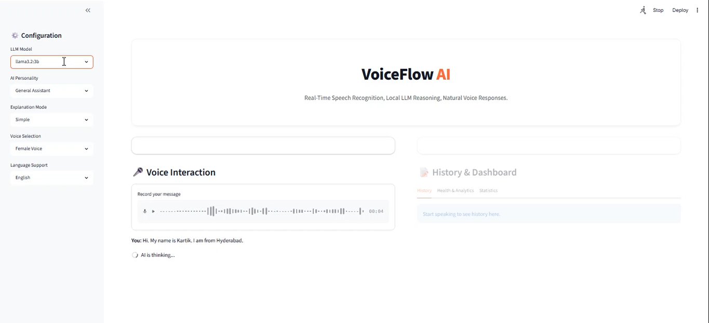

## Voice Interaction Pipeline

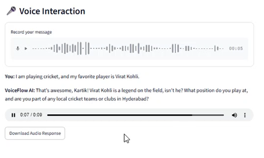

## Conversation Memory

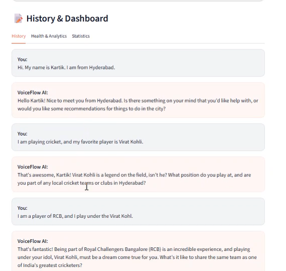

## Health Monitoring

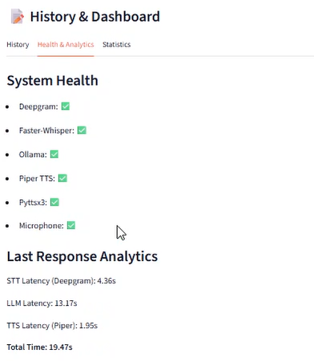

## Analytics Dashboard

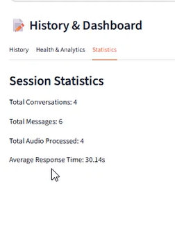

## Multi-Model Configuration

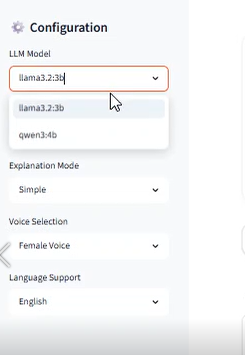

## Personality Engine

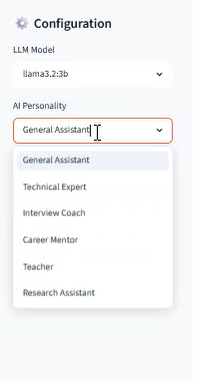

## Language Support

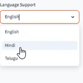

---

# 🚀 Features

| Category | Features |
|-----------|-----------|
| Speech Recognition | Deepgram STT, Faster-Whisper Fallback |
| AI Reasoning | Ollama Integration, Qwen3, Llama Models |
| Text-to-Speech | Piper TTS, pyttsx3 Fallback |
| Memory | Multi-Turn Context Retention |
| UI | Streamlit SaaS Dashboard |
| Monitoring | Health Dashboard, Validation Pipeline |
| Reliability | Automatic Fallback Architecture |
| Export | Conversation Export |
| Testing | Unit Testing + Pipeline Validation |

---

# 📊 System Capabilities

| Capability | Supported |
|------------|------------|
| Speech Recognition | ✅ |
| Multi-Turn Conversations | ✅ |
| Local AI Inference | ✅ |
| Text-to-Speech | ✅ |
| Voice Download | ✅ |
| PDF Export | ✅ |
| TXT Export | ✅ |
| Multi-Model Support | ✅ |
| Personality Switching | ✅ |
| Multi-Language Support | ✅ |
| Health Monitoring | ✅ |
| Analytics Dashboard | ✅ |
| Session Statistics | ✅ |

---

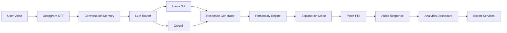

---


# 🏗 High-Level Architecture

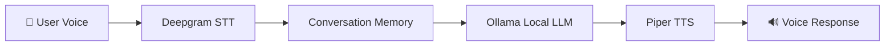

---

# 🧩 Component Architecture

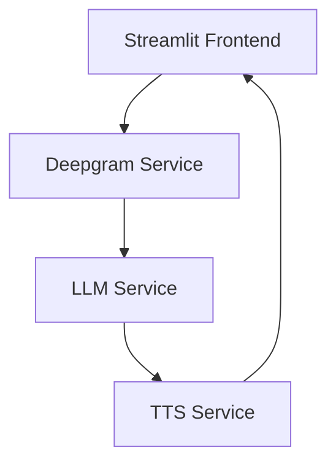

---

# 🔄 Sequence Diagram

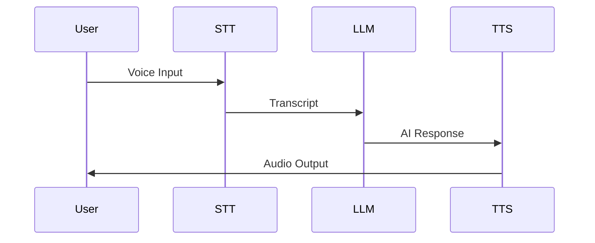

---

# ⚙ End-to-End Pipeline

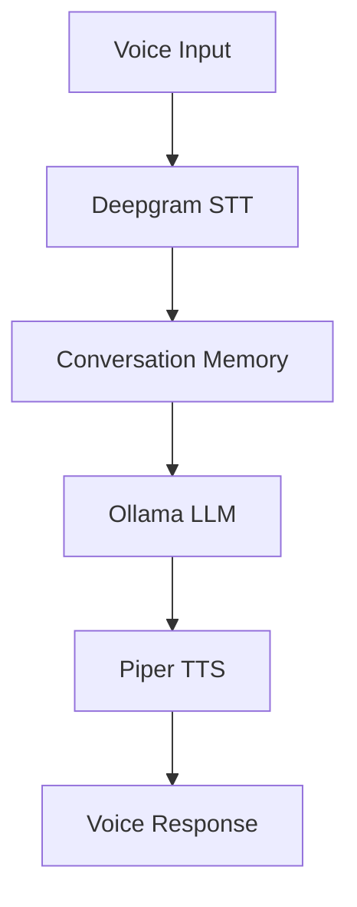

---

# 📂 Repository Structure

```text
voiceflow-ai/
│
├── app.py
├── requirements.txt
├── README.md
├── LICENSE
├── .gitignore
├── .env.example
│
├── services/
│   ├── deepgram_service.py
│   ├── llm_service.py
│   └── tts_service.py
│
├── utils/
│   └── utils.py
│
├── scripts/
│   └── validate_pipeline.py
│
├── tests/
│   ├── test_deepgram.py
│   ├── test_llm.py
│   └── test_tts.py
│
├── docs/
│
└── assets/
```

---

# 🛠 Technology Stack

| Layer | Technology |
|---------|------------|
| Frontend | Streamlit |
| Language | Python |
| Speech-to-Text | Deepgram |
| Fallback STT | Faster Whisper |
| LLM Runtime | Ollama |
| Models | Qwen3:4B, Llama3.2 |
| Text-to-Speech | Piper |
| Fallback TTS | pyttsx3 |
| Testing | unittest |
| Documentation | Markdown + Mermaid |

---

# 📊 System Metrics

| Metric | Capability |
|----------|------------|
| Real-Time Voice Input | ✅ |
| Multi-Turn Conversations | ✅ |
| Local AI Inference | ✅ |
| Offline Voice Generation | ✅ |
| Service Health Monitoring | ✅ |
| Automated Validation | ✅ |
| Fallback Recovery | ✅ |

---

# 🔒 Reliability Architecture

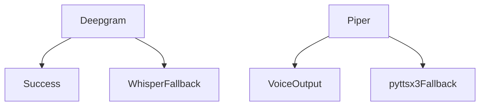

---

# 🚀 Installation

## Clone Repository

```bash
git clone https://github.com/mekalakarthik05/VoiceFlow-Ai.git
cd VoiceFlow-Ai
```

## Create Virtual Environment

```bash
python -m venv venv
```

### Windows

```bash
venv\Scripts\activate
```

### Linux / macOS

```bash
source venv/bin/activate
```

## Install Dependencies

```bash
pip install -r requirements.txt
```

---

# 🔑 Environment Configuration

Create:

```env
DEEPGRAM_API_KEY=your_api_key_here
```

---

# 🤖 Ollama Setup

Install Ollama and pull a model:

```bash
ollama pull qwen3:4b
```

or

```bash
ollama pull llama3.2:3b
```

---

# ▶ Running the Application

```bash
streamlit run app.py
```

---

# 🧪 Testing

Run Unit Tests

```bash
python -m unittest discover tests/
```

Validate Full Pipeline

```bash
python scripts/validate_pipeline.py
```

---

# 💡 Technical Challenges Solved

### Deepgram SDK Migration

Resolved compatibility issues introduced by newer Deepgram SDK versions.

### Audio Pipeline Engineering

Implemented proper WAV generation and audio channel configuration for Piper TTS.

### Event Loop Management

Resolved Streamlit and asynchronous service integration issues.

### Fallback Architecture

Implemented recovery mechanisms:

- Deepgram → Faster Whisper
- Piper → pyttsx3

---

# 📈 Engineering Achievements

- Built complete Speech-to-Speech AI pipeline
- Integrated 3 independent AI systems
- Implemented modular architecture
- Added automated validation framework
- Developed production-ready error handling
- Designed recruiter-grade portfolio project

---

# 💼 Resume Highlights

### VoiceFlow AI — Real-Time Conversational Voice Assistant

- Built an end-to-end AI voice assistant integrating Deepgram Speech-to-Text, Ollama LLMs, and Piper Text-to-Speech.
- Designed a modular speech-to-speech architecture with conversation memory and automated fallback recovery.
- Implemented local AI inference, real-time transcription, voice synthesis, and service validation pipelines.
- Developed a Streamlit-based SaaS-style interface with robust monitoring and health diagnostics.

---

# 🎤 Interview Explanation

VoiceFlow AI is a speech-to-speech conversational AI system.

The workflow begins when the user speaks into the microphone. Audio is sent to Deepgram for transcription. The generated transcript is passed to a locally running LLM through Ollama, which generates a contextual response while maintaining conversation memory. The response is then converted into speech using Piper TTS and played back to the user. The system also includes fallback mechanisms, validation pipelines, and service health monitoring to improve reliability.

---

# 🛣 Future Roadmap

- [ ] Streaming Speech Recognition
- [ ] Streaming LLM Responses
- [ ] Voice Cloning Support
- [ ] Multi-Language Conversations
- [ ] Mobile Application
- [ ] Cloud Synchronization
- [ ] Voice Biometrics
- [ ] Advanced Analytics Dashboard

---

# Support

If you found this project useful:

⭐ Star the Repository

🍴 Fork the Repository

📢 Share Feedback

---

# 📄 License

This project is licensed under the MIT License.
