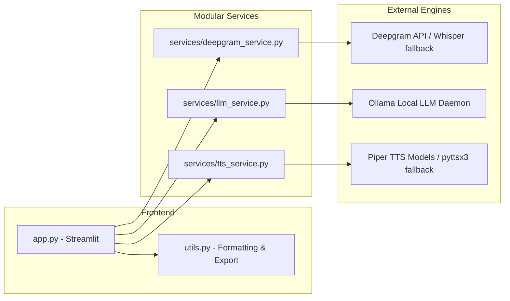
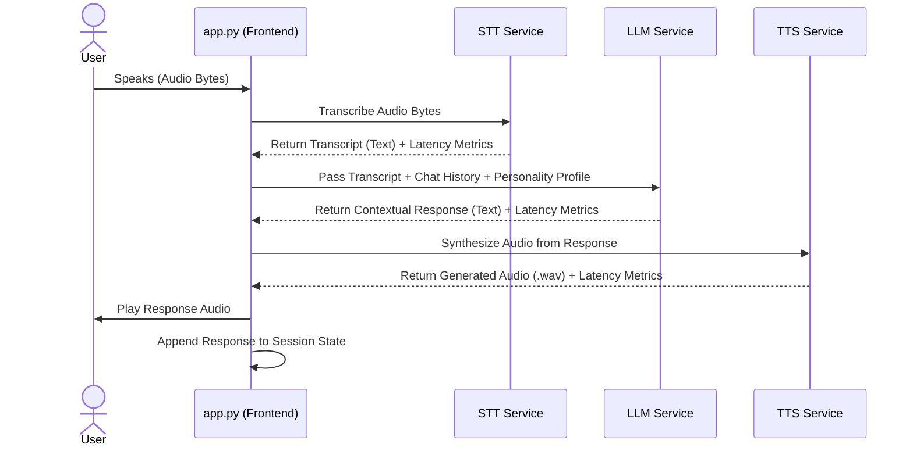
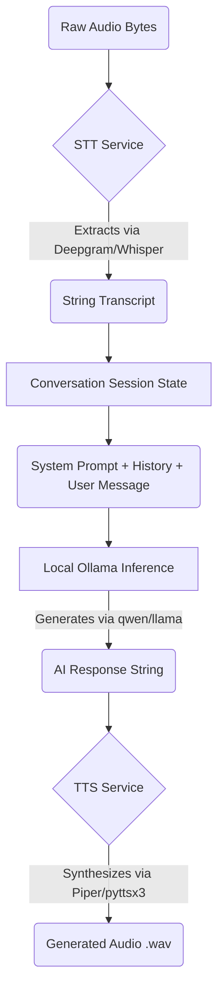

# VoiceFlow AI Architecture

## System Overview
VoiceFlow AI is architected as a modular, state-driven speech-to-speech pipeline managed via Streamlit. The application decouples UI logic from external AI services, allowing seamless integration and interchangeable models. Audio input is captured asynchronously, routed through a sequence of modular pipelines (STT -> LLM -> TTS), and played back, while maintaining local conversation history.

## 1. High-Level Component Diagram

## 2. Sequence Diagram

## 3. Data Flow Diagram

